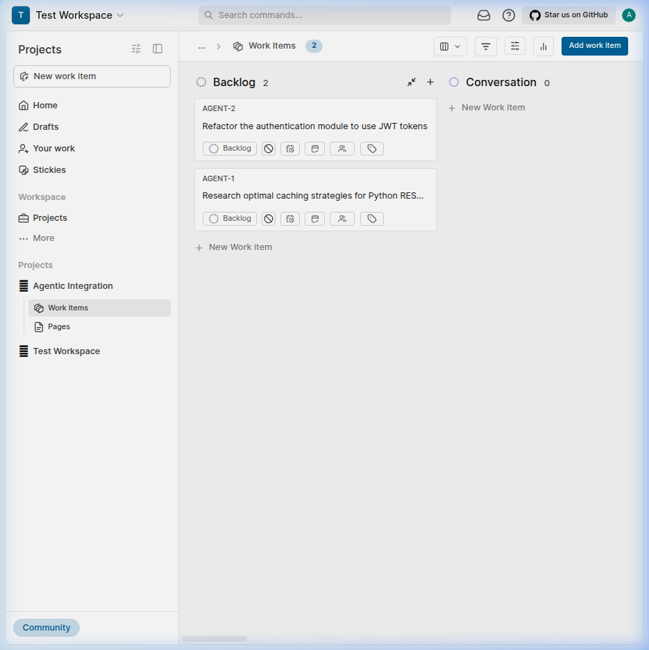
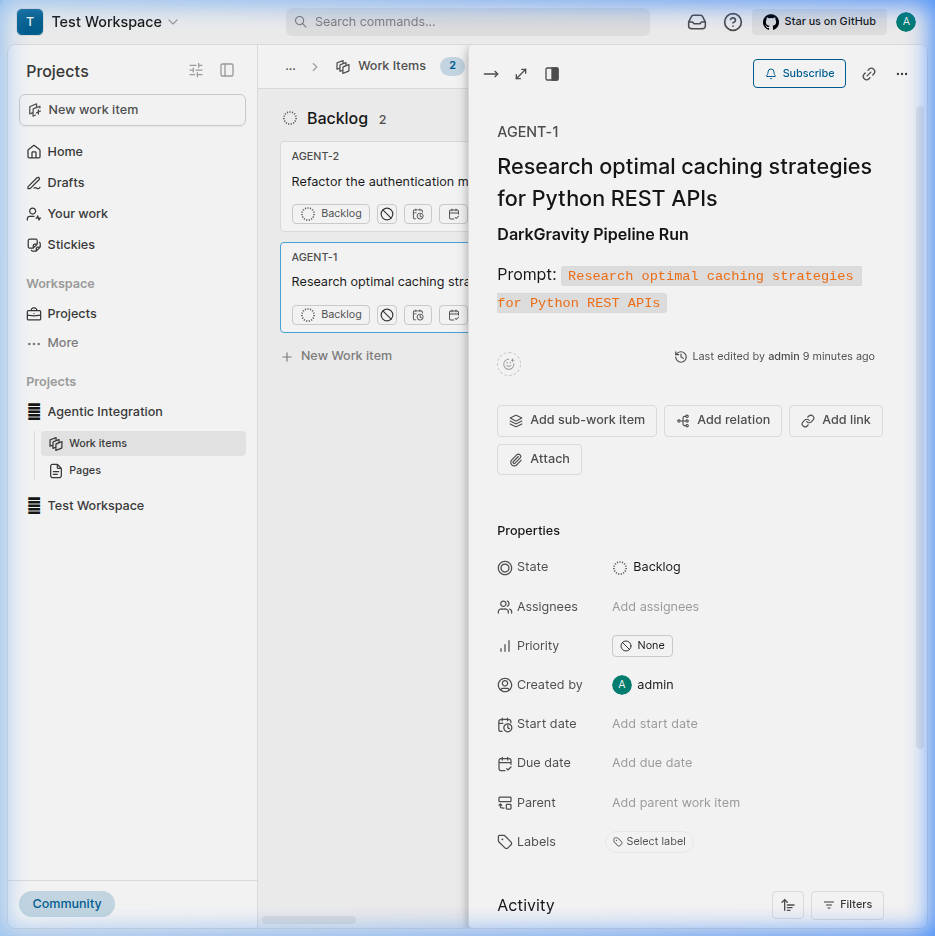
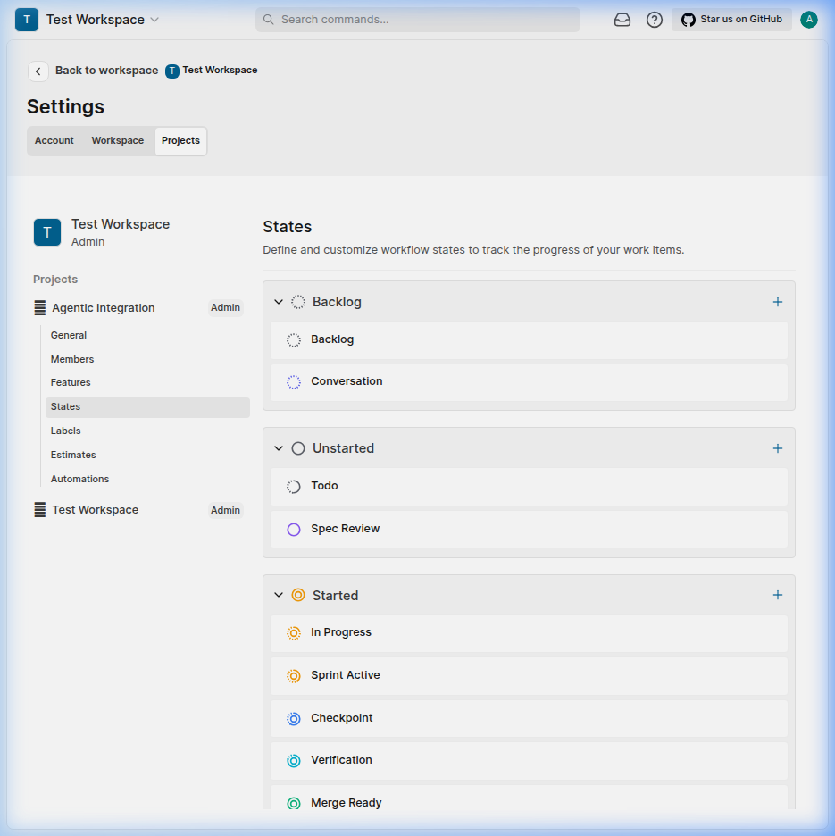

<p align="center">
  
</p>

<h1 align="center">Agentic Plane</h1>

<p align="center">
  <b>Autonomous AI agents. Governed workflows. One command center.</b>
</p>

<p align="center">
  Built on top of <a href="https://github.com/makeplane/plane">Plane</a> — the open-source project management tool — to create a fully automated <b>Agentic Development Lifecycle</b> where AI agents plan, execute, verify, and deploy code under human governance.
</p>

<p align="center">
  <a href="#-what-is-this">What is this?</a> •
  <a href="#-screenshots">Screenshots</a> •
  <a href="#-architecture">Architecture</a> •
  <a href="#%EF%B8%8F-quickstart">Quickstart</a> •
  <a href="#-the-agentic-loop">The Agentic Loop</a> •
  <a href="#-codex-governance">CODEX Governance</a>
</p>

---

## 🧬 What is this?

**Agentic Plane** extends [Plane's](https://plane.so) codebase with an automation layer that lets AI agents operate as first-class team members:

- 🤖 **Agents auto-create work items** — every pipeline run generates a tracked Plane ticket
- 🔄 **State changes trigger pipelines** — drag a card to "Sprint Active" and an AI agent starts coding
- 🏷️ **CODEX taxonomy enforcement** — governance protocols, agent roles, and priority levels are baked into the label system
- 📊 **Cost & token tracking** — know exactly how much each agent run costs in API tokens
- 🪝 **Webhook-driven orchestration** — a FastAPI listener bridges Plane events to DarkGravity agent pipelines

This isn't a Plane fork. It's an **agentic control plane** that sits on top of Plane's API and turns it into a mission control for autonomous AI development.

---

## 📸 Screenshots

### The Board — Agent Work Items Created Automatically

Every time an agent pipeline runs, a work item appears on the board. No human had to type these in.

<p align="center">
  
</p>

### Work Item Detail — Full Pipeline Context

Each auto-created ticket captures the original prompt, the agent that ran it, and the DarkGravity pipeline metadata.

<p align="center">
  
</p>

### Custom Agentic States — The Development Lifecycle

Seven custom workflow states map to the Agentic Development Lifecycle, from initial conversation through deployment.

<p align="center">
  
</p>

---

## 🏗️ Architecture

```
┌─────────────────────────────────────────────────────────────┐
│                    AGENTIC CONTROL PLANE                    │
│                                                             │
│  ┌──────────────┐  ┌──────────────┐  ┌──────────────────┐  │
│  │ agentic_run  │  │ codex_sync   │  │ cost_logger      │  │
│  │              │  │              │  │                  │  │
│  │ Auto-creates │  │ Syncs CODEX  │  │ Tracks tokens &  │  │
│  │ work items   │  │ docs to Page │  │ costs per ticket │  │
│  └──────┬───────┘  └──────┬───────┘  └────────┬─────────┘  │
│         │                 │                    │            │
│         └─────────────────┼────────────────────┘            │
│                           │                                 │
│                  ┌────────▼────────┐                        │
│                  │  plane_bridge   │                        │
│                  │  (Hybrid Client)│                        │
│                  └────────┬────────┘                        │
│                           │ REST API                        │
├───────────────────────────┼─────────────────────────────────┤
│                           │                                 │
│              ┌────────────▼────────────┐                    │
│              │      PLANE (Docker)     │                    │
│              │                         │                    │
│              │  ┌─────┐ ┌─────┐       │                    │
│              │  │ API │ │ Web │       │   ◄── Webhook ──┐  │
│              │  └─────┘ └─────┘       │                 │  │
│              │  ┌─────┐ ┌─────┐       │    ┌────────────┴┐ │
│              │  │ DB  │ │Redis│       │    │  webhook    │ │
│              │  └─────┘ └─────┘       │    │  listener   │ │
│              └────────────────────────┘    └─────────────┘ │
└─────────────────────────────────────────────────────────────┘
```

---

## 🔄 The Agentic Loop

Work items flow through seven custom states that mirror a complete AI development lifecycle:

| State | What Happens |
|-------|-------------|
| **Conversation** | Human defines intent. Agent is listening. |
| **Spec Review** | Agent produces a specification. Human reviews. |
| **Sprint Active** | Agent is writing code. Webhook triggers the pipeline. |
| **Checkpoint** | Agent pauses for human review mid-sprint. |
| **Verification** | Automated tests run. Agent validates its own work. |
| **Merge Ready** | Code passes review. Ready for integration. |
| **Deployed** | Live in production. The loop closes. |

When a ticket moves to **Sprint Active**, the webhook listener automatically triggers a DarkGravity pipeline. When the pipeline finishes, it moves the ticket to **Verification**. Humans only intervene at checkpoints.

---

## 🏛️ CODEX Governance

Every work item is tagged with labels from the **CODEX taxonomy** — a structured governance framework that ensures agents operate within defined boundaries:

| Category | Labels |
|----------|--------|
| **Governance** | `GOV-001` through `GOV-006` — protocol enforcement |
| **Agent Roles** | `agent:architect`, `agent:researcher`, `agent:coder`, `agent:tester` |
| **Priority** | `P0-critical`, `P1-high`, `P2-medium`, `P3-low` |
| **Work Type** | `blueprint`, `defect`, `research`, `evolution`, `feature` |

The full CODEX framework lives in the [`CODEX/`](CODEX/) directory — governance protocols, blueprints, runbooks, and evolution plans that define how agents are allowed to operate.

---

## ⚡️ Quickstart

### Prerequisites

- Docker & Docker Compose
- Python 3.12+
- Git

### 1. Clone & Start

```bash
git clone https://github.com/BigRigVibeCoder/agentic_plane.git
cd agentic_plane
sudo docker compose up -d
```

### 2. Set Up Plane

Open [http://localhost](http://localhost), create an account, workspace, and project. Generate a Personal Access Token.

### 3. Configure

```bash
python3 -m venv .venv && source .venv/bin/activate
pip install requests fastapi uvicorn pytest requests-mock markdown pyyaml httpx

export PLANE_API_KEY="your-token-here"
export PLANE_WORKSPACE_SLUG="your-workspace"
export PLANE_PROJECT_ID="your-project-uuid"
```

### 4. Provision the Agentic Workflow

```bash
python plane_agentic_setup.py \
  --api-key "$PLANE_API_KEY" \
  --workspace "$PLANE_WORKSPACE_SLUG" \
  --project "$PLANE_PROJECT_ID"
```

This creates the 7 custom states and 24 CODEX taxonomy labels in your Plane project.

### 5. Create Your First Agent Work Item

```bash
python agentic_run.py "Research the best approach for distributed caching"
```

Open Plane — your work item is on the board. 🎉

### 6. Start the Webhook Listener

```bash
uvicorn webhook_listener:app --host 0.0.0.0 --port 9000
```

Now drag a ticket to "Sprint Active" and watch the pipeline fire.

📖 **Full step-by-step guide:** [`CODEX/30_RUNBOOKS/RUN-001_Quickstart.md`](CODEX/30_RUNBOOKS/RUN-001_Quickstart.md)

---

## 🧪 Testing

```bash
pytest tests/ -v
```

```
8 passed in 0.33s ✅
```

All tests follow the [GOV-002 Testing Protocol](CODEX/10_GOVERNANCE/GOV-002_TestingProtocol.md) with unit, integration, and end-to-end coverage.

---

## 📁 Project Structure

```
agentic_plane/
├── plane_bridge.py              # Hybrid API client (REST + MCP ready)
├── plane_agentic_setup.py       # Provisions states & labels
├── agentic_run.py               # Auto-creates tickets + runs pipelines
├── agentic_cost_logger.py       # Logs token costs to work items
├── codex_to_plane_sync.py       # Syncs CODEX docs to Plane Pages
├── webhook_listener.py          # FastAPI webhook → pipeline trigger
├── plane_views_config.json      # Dashboard view definitions
├── docker-compose.yml           # Full Plane stack (12 containers)
├── tests/                       # GOV-002 compliant test suite
├── CODEX/                       # Governance framework
│   ├── 10_GOVERNANCE/           # Protocols & standards
│   ├── 20_BLUEPRINTS/           # Architecture docs
│   ├── 30_RUNBOOKS/             # Operational guides
│   ├── 40_SPECS/                # Technical specifications
│   └── 60_EVOLUTION/            # Sprint plans & roadmap
└── apps/                        # Plane source (upstream)
```

---

## 🤝 Built On

This project extends [**Plane**](https://github.com/makeplane/plane) — the open-source, self-hosted project management tool. Plane provides the UI, API, and data layer. We add the agentic automation layer on top, interacting exclusively through Plane's REST API without modifying its source code.

---

## 📜 License

This project builds on Plane's codebase. See [Plane's license](https://github.com/makeplane/plane/blob/master/LICENSE) for details on the upstream project. The agentic automation layer (scripts in the root directory) is provided as-is for demonstration purposes.
